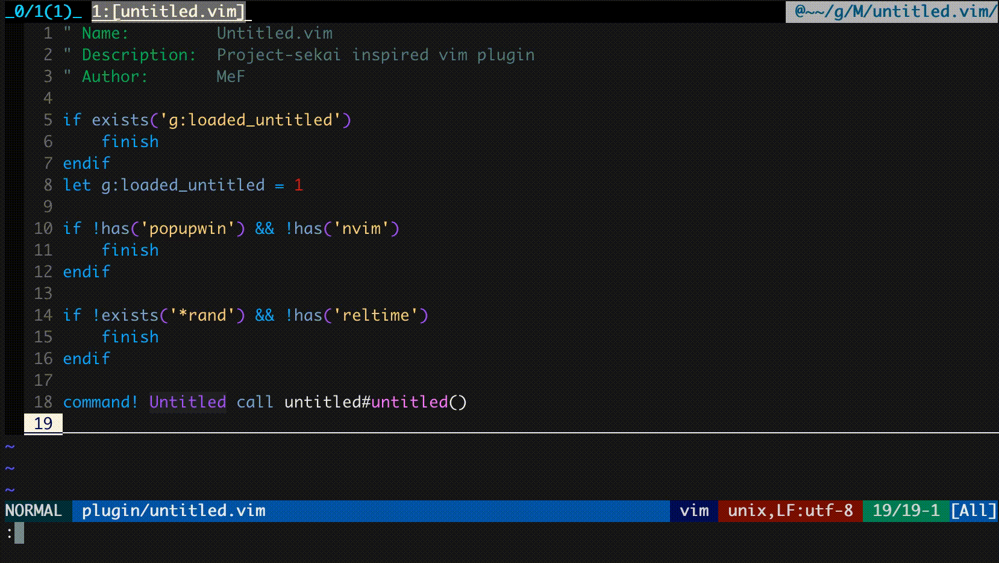

# Untitled.vim

This is [Project Sekai](https://pjsekai.sega.jp/) inspired __unofficial__ vim plugin.

<!--  -->


## Requirements

- random number generator
```vim
echo exists('*rand') " == 1
```
- popup window
```vim
echo has('popupwin')  " == 1
```
___NeoVim is not supported yet___

## Installation

If you use dein,
```vim
call dein#add('MeF0504/untitled.vim')
```
or do something like this.

## Usage

The following command
```vim
Untitled
```
will lead you to your "sekai"

## Future Plan
- upgrade the motion
    - rotate triangles etc...

